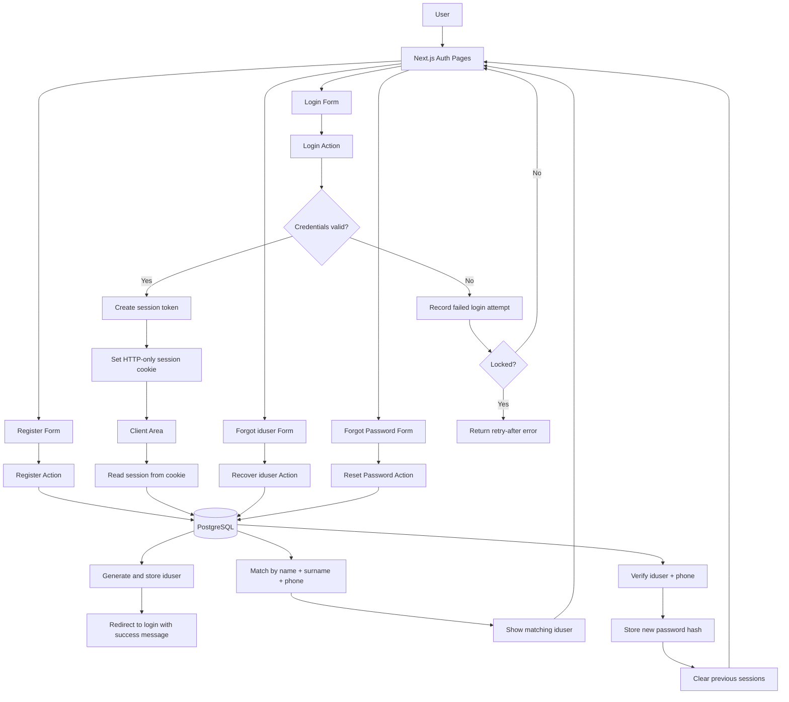

# Login Template

[](./LICENSE)
[](https://github.com/12MICKY/login-template/actions/workflows/ci.yml)


A reusable Next.js authentication starter for projects that need a practical login flow with account recovery and registration out of the box.

This template includes:

- login with `iduser + password`
- account recovery entry page
- forgot `iduser` flow
- forgot password flow
- registration with auto-generated `iduser`
- server-side session handling
- demo user seeding for local development
- Docker support for fast setup

## Open Source

- License: MIT
- Contribution guide: `CONTRIBUTING.md`
- CI: GitHub Actions runs `lint` and `build` on `push` and `pull_request`

## System Flowchart



## Release Notes

### v0.3.0

- converted the README to English
- added badges for MIT, CI, Next.js, and PostgreSQL
- added a Mermaid system flowchart for the authentication flow

### v0.2.0

- added demo account support through environment variables
- added automatic demo-user seeding when `DEMO_USER_PASSWORD` is configured
- added `Dockerfile` and `docker-compose.yml` for fast local startup with PostgreSQL
- exposed demo account information on the homepage through `NEXT_PUBLIC_DEMO_*`

## Features

- Auto-generate `iduser` values during registration
- Authenticate with `iduser + password`
- Recover `iduser` using `name + surname + phone`
- Reset password using `iduser + phone + new password`
- Store sessions in an HTTP-only cookie
- Temporarily lock repeated failed login attempts
- Seed a public-safe demo account for local development
- Start the app and database quickly with Docker Compose

## Quick Start

1. Install dependencies

```bash
npm install
```

2. Copy the environment file

```bash
cp .env.example .env.local
```

3. Start your PostgreSQL database, then run the app

```bash
npm run dev
```

4. Open `http://localhost:3000`

## Demo Account

Default values in `.env.example`:

- `iduser`: `GL0001`
- `password`: `DemoPass123`

If `DEMO_USER_PASSWORD` is set, the app will automatically seed the demo user during schema initialization.

## Docker

Start both the app and PostgreSQL:

```bash
docker compose up --build
```

Stop the stack:

```bash
docker compose down
```

After startup, open `http://localhost:3000`.

## Project Structure

- `app/(auth)/login` login page and server action
- `app/(auth)/register` registration page and user creation flow
- `app/(auth)/forgot-iduser` user ID recovery flow
- `app/(auth)/forgot-password` password reset flow
- `app/(auth)/account-recovery` shared recovery entry page
- `app/client_area` protected example page after login
- `lib/auth-store.ts` database access and auth business logic
- `docker-compose.yml` local app + database stack
- `Dockerfile` production-style app container build

## Validation

Run these before opening a pull request:

```bash
npm run lint
npm run build
```

## Notes

- This repository is meant to be a reusable example, not a business-specific implementation.
- For production use, you should add stronger recovery controls such as email, OTP, audit logging, network-level rate limiting, and stricter validation based on your requirements.
